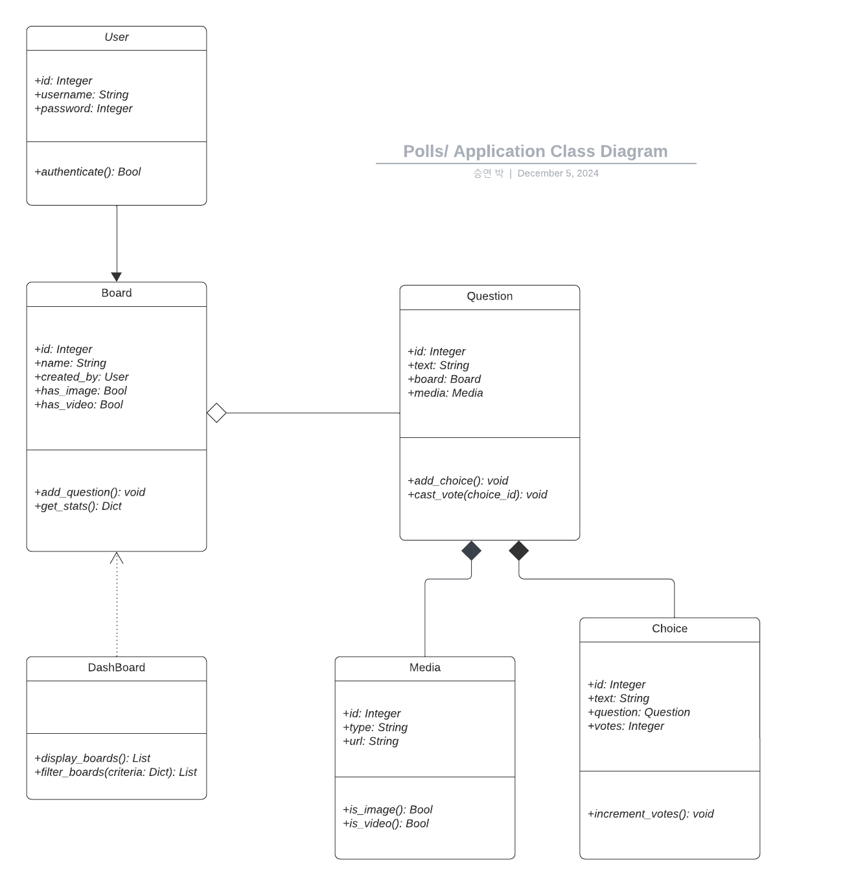

This develop/init branch is to initialize and upload raw version of demo v.2.0 django application.  Will use develop/{'stage'} as branches to save routes for rollback.

### Class Diagram (UML) of Polls application

